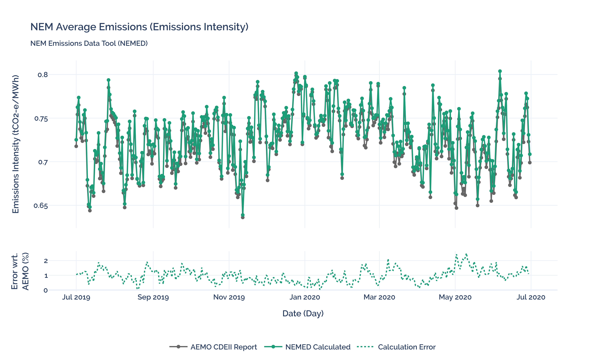

# NEMED

[](https://github.com/psf/black)
[](https://nemed.readthedocs.io/en/latest/?badge=latest)

NEMED[^1], or NEM Emissions Data, is a python package to retrieve and process historical emissions data of the National Electricity Market (NEM), produced by datasets published by the Australian Energy Market Operator (AEMO).

[^1]: Not to be confused with *"Nemed", "Nimeth"* of the [Irish legend](https://en.wikipedia.org/wiki/Nemed), who was the leader of the third group of people to settle in Ireland.

## Installation
```bash
pip install nemed
```

## Introduction

This tool is designed to allow users to retrieve historical NEM emissions data, both total and average emissions (intensity index) metrics, as well as marginal emissions, for any dispatch interval or aggregations thereof. Although data is published by AEMO via the [Carbon Dioxide Equivalent Intensity Index (CDEII) Procedure](https://www.aemo.com.au/energy-systems/electricity/national-electricity-market-nem/market-operations/settlements-and-payments/settlements/carbon-dioxide-equivalent-intensity-index) this only reflects a daily summary by region of total and average emissions.

### How does NEMED calculate emissions?
Total and Average Emissions are computed by considering 5-minute dispatch interval data for each generator in the NEM for the respective regions, along with their CO2-equivalent emissions factors per unit (generator)-level. A detailed method of the process to produce results for: total emissions(tCO2-e), or average emissions, also referred to as emisssions intensity (tCO2-e/MWh), can be found [here](method.md). The tool is able to provide these metrics on a dispatch interval basis, or aggregated to hourly, daily or monthly measures.

Marginal Emissions are computed by extracting the marginally dispatched generators from AEMO's Price Setter files, mapping emissions intensity metrics mentioned above and hence computing marginal emissions (tCO2-e/MWh).

### How accurate is NEMED?
A [benchmark example](https://nemed.readthedocs.io/en/latest/examples/example_1.html#results-comparison-to-aemo) of total and average emissions provides a comparison between AEMO's daily CDEII reported emissions figures and NEMED's emissions figures which have been aggregated from a dispatch-interval resolution to a daily basis.   

The example includes a region by region comparison for each metric, while an overview of the NEM Emissions Intensity for FY19-20 is shown here.


## Usage

### Examples
Examples can be found in [NEMED's documentation](https://nemed.readthedocs.io/en/latest/examples/examples_1.html).

## Contributing
Interested in contributing? Check out the [contributing guidelines](CONTRIBUTING.md), which also includes steps to install `NEMED` for development.

Please note that this project is released with a [Code of Conduct](CONDUCT.md). By contributing to this project, you agree to abide by its terms.

## License
`NEMED` was created by Declan Heim and Shayan Naderi. It is licensed under the terms of the `BSD 3-Clause license`.

## Credits
This template was created using the [`UNSW CEEM template`](https://github.com/UNSW-CEEM/ceem-python-template). It also adopts functionality from sister tools including [`NEMOSIS`](https://github.com/UNSW-CEEM/NEMOSIS) and [`NEMPY`](https://github.com/UNSW-CEEM/nempy).

## Contact Us
Have questions or feedback on this tool? Please reach out via email [declanheim@outlook.com](mailto:declanheim@outlook.com).